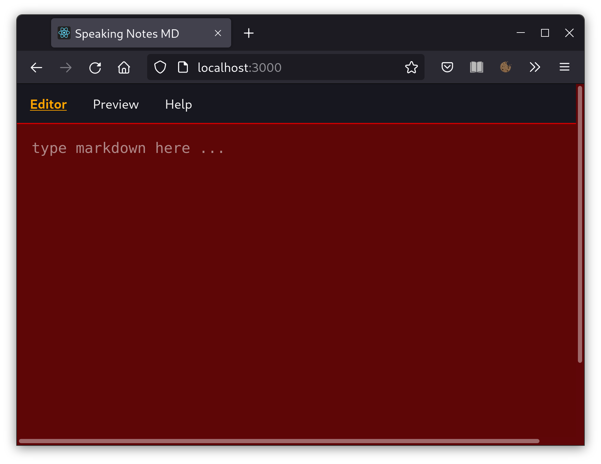

# Speaking-Notes-Markdown

Demo-Project for learning purpose.
Provide accessibility for visual-impared users.

Simple markdown-editor uses React.js, React-markdown, Styled-Components, Context-API.

 

:note: **Just under development!**
___

## Changelog:
- **v 4.0.0:**  uses markdown and preview side by side
- **v 4.1.0:**  add NavBar and uses React-Router

## Sources:

Philip Ackermann: 'Webentwicklung', Rheinwerk Verlag, 1. Auflage 2021

[bestofreact.com](https://bestofreactjs.com/repo/rexxars-react-markdown)

[CodeSandbox: Islem Mabood, markdown-editor](https://codesandbox.io/s/markdown-editor-7c199?file=/src/components/markedInput.jsx:161-292)

**Markdown-logo, svg:**  

Von Dustin Curtis - https://github.com/dcurtis/markdown-mark/tree/master/svg, CC0, https://commons.wikimedia.org/w/index.php?curid=31095459

