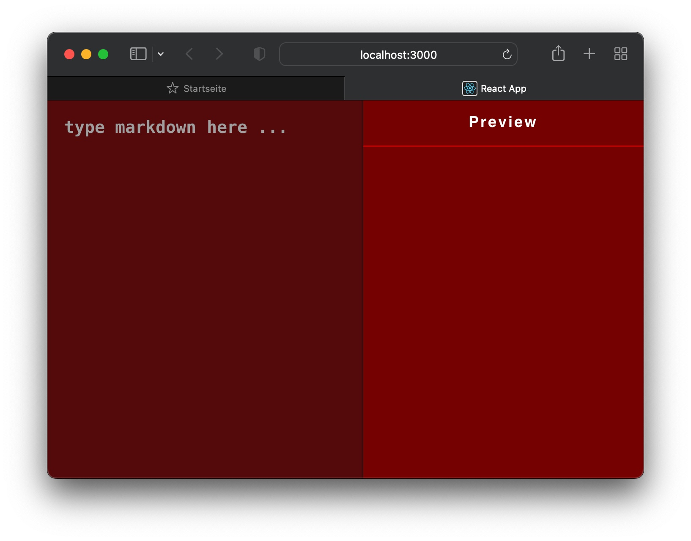

# Speaking Markdown

Demo-Project for learning purpose.
Provide accessibility for visual-impared users.

Simple markdown-editor uses React.js, React-markdown, Styled-Components, Context-API.

 

:note: **Just under development!**
___

## Sources:

Philip Ackermann: 'Webentwicklung', Rheinwerk Verlag, 1. Auflage 2021

[bestofreact.com](https://bestofreactjs.com/repo/rexxars-react-markdown)

[CodeSandbox: Islem Mabood, markdown-editor](https://codesandbox.io/s/markdown-editor-7c199?file=/src/components/markedInput.jsx:161-292)
